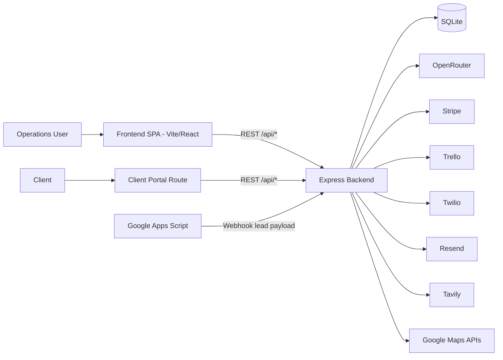
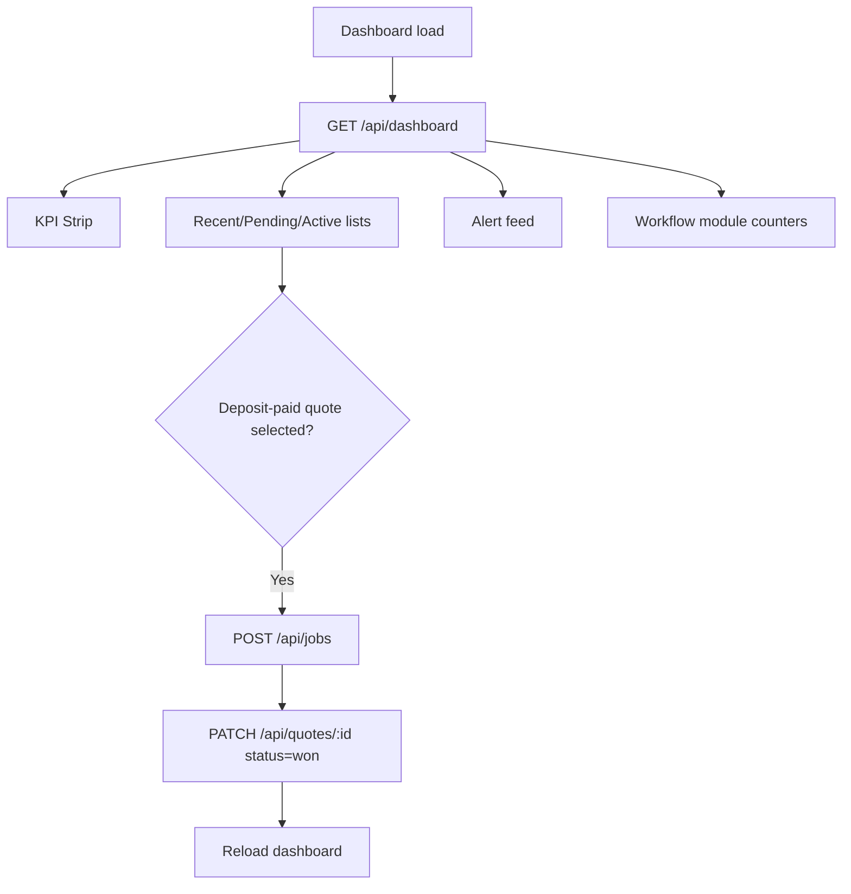
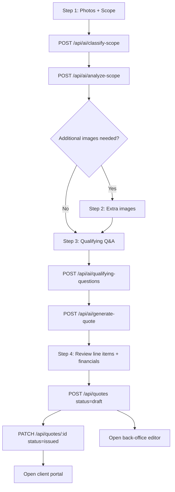
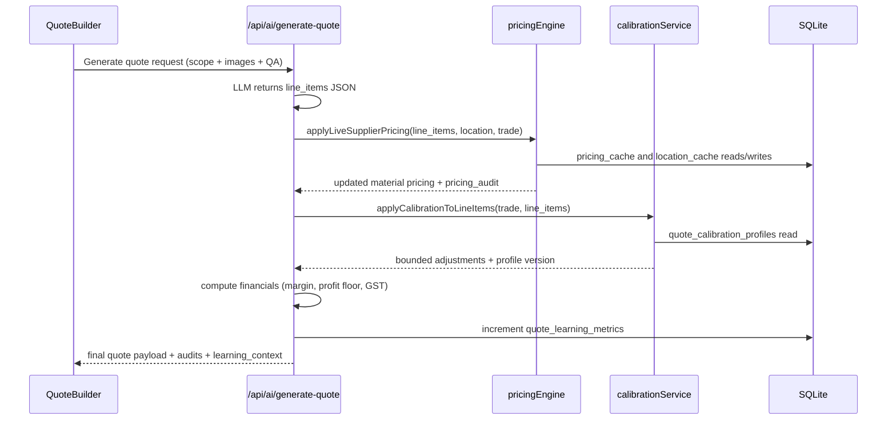
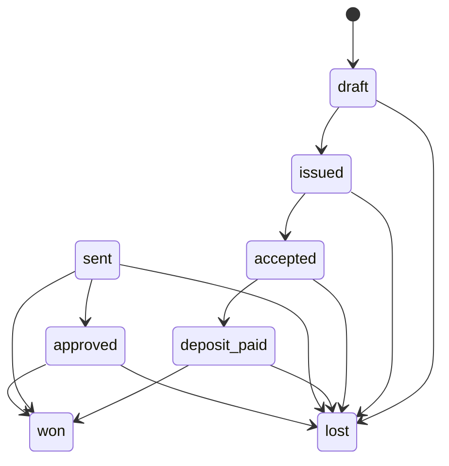

# OSV Construct OS - Comprehensive Technical Dossier

## Document Purpose

This dossier consolidates:

1. A full functional and architectural write-up of the codebase.
2. A complete API contract reference (frontend-to-backend mappings, request/response behavior, state transitions).
3. A security and risk audit (severity-ranked findings, exploitability, and remediation roadmap).

This document is intended for engineering leadership, product/operations stakeholders, and implementation teams.

---

## Table of Contents

1. Executive Summary
2. System Architecture
3. Frontend Functionality and UX Journeys
4. Backend Functionality and Service Architecture
5. Data Model and Persistence Strategy
6. AI Quoting Pipeline (End-to-End)
7. Learning Loop and Model Calibration
8. Integrations (Stripe, Twilio, Resend, Trello, Tavily, Google Maps)
9. API Contract Reference
10. State Machines and Business Rules
11. Security and Risk Audit
12. Reliability, Performance, and Operability Assessment
13. Recommended Remediation Roadmap
14. Deployment and Environment Model
15. Appendix: Frontend/Backend Endpoint Mapping

---

## 1) Executive Summary

This repository implements a vertical SaaS operating system for a construction trades business ("Build With OSV"). It combines:

- **AI-assisted quote generation** from site photos + structured scope fields.
- **Back-office quote revision workflows** with audit trails.
- **Client portal quote acceptance and deposit payment** via Stripe.
- **Operations dashboarding** for leads, quotes, and jobs.
- **Subcontractor assignment and dispatch workflows** with Trello + Twilio.
- **A learning loop** where manual quote edits become calibration signals for future AI quotes.

### Primary Technical Stack

- Frontend: Vite + React 19 + React Router + Axios + Tailwind 4
- Backend: Express 5 + better-sqlite3 + ESM
- Database: SQLite with schema + inline migrations
- AI: OpenRouter via Anthropic SDK client wrapper

### Core Strengths

- Strong quote lifecycle architecture from generation to payment.
- Distinctive human-in-the-loop learning design (revision deltas -> calibration profiles -> future quote biasing).
- Clear separation between frontend and backend deployment surfaces.

### Primary Risks

- Missing authentication/authorization on sensitive operational endpoints.
- Mixed API base URL strategy in frontend (part env-driven, part hardcoded production URL).
- Open webhook and payment confirmation surfaces require hardening.
- Limited automated testing coverage across critical workflows.

---

## 2) System Architecture

### Deployment Split

- **Backend** deployed to Render (`render.yaml`) with persistent disk mount for SQLite.
- **Frontend** deployed to Vercel (`frontend/vercel.json`) with SPA rewrite to `index.html`.

### Runtime Entry Points

- Backend: `osv-construct-os/backend/src/index.js`
- Frontend: `osv-construct-os/frontend/src/main.jsx`
- SPA Routes: `osv-construct-os/frontend/src/App.jsx`

---

## 3) Frontend Functionality and UX Journeys

## 3.1 Route Map

- `/` -> Dashboard
- `/pipeline` -> Leads pipeline
- `/quotes/new` -> AI quote builder wizard
- `/quotes/:quoteRef/edit` -> Back-office quote editor
- `/client/quote/:quoteId` -> Client-facing quote/payment portal
- `/jobs` -> Job delivery board
- `/subcontractors/join` -> Subcontractor onboarding
- `/subcontractors/:id` -> Subcontractor profile
- `/admin` -> Admin dashboard shell

## 3.2 Dashboard UX (`/`)

Purpose: Operational command center.

Displays:
- KPI strip (open leads, draft quotes, active jobs, pending approvals, jobs at risk)
- Recent quotes and edit shortcuts
- Pending approval list
- Deposit-paid quotes ready for job creation handoff
- Active jobs list with simple risk indicators
- Alerts panel
- Module counters and pipeline values

## 3.3 Quote Builder UX (`/quotes/new`)

A multi-step AI-assisted workflow:

1. Gather site photos + structured scope + location metadata.
2. AI classifies and enriches scope.
3. Optional additional photos requested by AI.
4. AI asks qualifying questions.
5. AI generates quote with financials.
6. User saves draft and/or issues to portal.

Notable UX capability:
- Optional **live pricing refresh** from quote review.
- Back-office material override dropdowns tied to pricing audit options.
- Debug panel support for supplier attempt introspection.

## 3.4 Back-Office Quote Editor (`/quotes/:quoteRef/edit`)

Capabilities:
- Fetch quote by id/reference.
- Edit summary and line items.
- Recompute totals and financials locally.
- Enforce required edit reason.
- Save revision snapshot.
- Display revision timeline and per-revision delta details.
- Export CSV of all quote deltas.

## 3.5 Client Portal (`/client/quote/:quoteId`)

State-driven UX:
- `draft`: not yet issued.
- `issued/sent`: accept quote action available.
- `accepted`: secure deposit payment action available.
- `deposit_paid/won`: success state and milestone confirmation.

Handles return URL params for payment confirmation:
- `success=true`
- `session_id=<stripe session>`

On successful confirmation, backend marks quote as `deposit_paid`.

## 3.6 Other Surface Modules

- Pipeline (`/pipeline`): lead stage board.
- Jobs (`/jobs`): operational assignment and status progression board.
- Subcontractor profile/onboarding: CRM-style workforce registry surfaces.
- Admin: currently a shell/prototype-oriented interface.

---

## 4) Backend Functionality and Service Architecture

## 4.1 API Composition

Mounted routers:

- `/api/leads`
- `/api/quotes`
- `/api/webhook`
- `/api/ai`
- `/api/subcontractors`
- `/api/jobs`
- `/api/checkout`
- `/api/twilio`
- `/api/dashboard`
- `/health`

Payload size limits are configured to 50MB for image-heavy quote workflows.

## 4.2 Domain Boundaries

### Quotes domain
- Creation, retrieval, status transitions
- Revision capture and delta analytics
- Learning metric counters

### AI domain
- Image requirement determination
- Scope classification and analysis
- Qualifying questions
- Quote generation with pricing + calibration

### Jobs domain
- Job creation from operational flow
- Assignment and dispatch
- Trello status synchronization

### Client payment domain
- Stripe session creation and payment confirmation

### Voice/transcript domain
- Twilio call bridging and recording callback processing
- OpenRouter audio transcription
- Resend email transcript delivery

---

## 5) Data Model and Persistence Strategy

## 5.1 Storage engine

- SQLite via `better-sqlite3`
- DB path is controlled by `DB_DIR` env variable, fallback local path under backend.
- Render uses persistent disk mount to preserve runtime DB state.

## 5.2 Primary tables

- Core ops: `leads`, `quotes`, `jobs`, `subcontractors`, `clients`, `users`
- Financial/project artifacts: `variations`, `invoices`
- Learning loop:
  - `quote_revisions`
  - `quote_adjustment_deltas`
  - `quote_calibration_profiles`
  - `quote_prompt_profiles`
  - `quote_learning_metrics`
- Caches:
  - `pricing_cache`
  - `location_cache`

## 5.3 Migration pattern

Migrations are inline SQL statements executed in startup; failures are swallowed for idempotence (e.g., column already exists). This is pragmatic but has governance trade-offs (see risk section).

---

## 6) AI Quoting Pipeline (End-to-End)

## 6.1 Input model

Inputs combine:
- Job type and subcategory
- Trade-specific scope fields
- Freeform description/site notes
- Suburb/postcode
- 3-5 image payloads (base64)
- Optional Q&A responses

## 6.2 AI phase decomposition

1. **Classify scope** from visual + structured context.
2. **Analyze scope** and auto-hydrate scope fields.
3. **Generate qualifying questions** for missing constraints.
4. **Generate final quote JSON** with line items and risk level.

## 6.3 Post-model enrichment

After generation:
- Optional live supplier pricing pass for materials.
- Optional manual material overrides.
- Deterministic calibration adjustment pass.
- Financial rollups:
  - risk margin mapping
  - minimum profit floor
  - GST computation

---

## 7) Learning Loop and Model Calibration

This is the codebase's most differentiated capability.

## 7.1 Revision capture

Back-office edits are persisted with:
- before/after JSON snapshots
- reason metadata
- editor/source metadata
- total deltas

Per-line normalized deltas are generated for changed items only.

## 7.2 Calibration profile updates

`updateCalibrationFromDeltas` aggregates observed drift:
- by trade/category/item signature
- sample counts
- average unit/total delta percentage
- confidence score
- profile versioning

## 7.3 Future quote influence

Two mechanisms:
- Prompt-level hints (`getCalibrationPromptHints`)
- Deterministic bounded adjustment (`applyCalibrationToLineItems`)

This reduces unbounded model behavior and preserves explainability.

---

## 8) Integrations

## 8.1 Stripe

- Create checkout session for 30% deposit (default)
- Validate quote status precondition (`accepted`)
- Confirm payment by session retrieval + metadata validation
- Update quote state to `deposit_paid`

## 8.2 Twilio + OpenRouter Audio + Resend

- Inbound voice flow uses TwiML dial to SIP endpoint.
- Recording callback fetches audio and transcribes via OpenRouter audio model.
- Transcript and recording link emailed via Resend.

## 8.3 Trello

- New jobs create Trello cards.
- Job status transitions can move Trello cards between configured list IDs.

## 8.4 Tavily + Google Maps

- Tavily search extracts material price candidates.
- Google Maps geocode/route used for supplier drive-time ranking.
- Cache and retry strategies are implemented with basic circuit behavior.

---

## 9) API Contract Reference

All endpoints below are prefixed by their mounted route roots.

## 9.1 `/health`

### GET `/health`
- Purpose: service and DB readiness indicator.
- Response: `{ status: "ok", db: "connected|disconnected" }`

---

## 9.2 Leads API (`/api/leads`)

### GET `/`
- Purpose: list leads.
- Response: `{ success: true, data: Lead[] }`

### POST `/`
- Purpose: create simple lead.
- Body (minimal): `{ client_name, suburb, job_title, value, description }`
- Response: `{ success: true, data: Lead }`

---

## 9.3 Webhook API (`/api/webhook`)

### POST `/leads`
- Purpose: ingest email/webhook-origin lead payload.
- Body example:
  - `subject`, `body`, `from`, optional `source`
- Response: `{ success: true, leadId }`

---

## 9.4 AI API (`/api/ai`)

### POST `/determine-images`
- Purpose: generate required photo checklist.
- Required body fields: job context (job type, description, dimensions, notes).
- Response shape:
  - `{ success: true, data: { required_images: [{title, description, mandatory}] } }`

### POST `/qualifying-questions`
- Purpose: generate follow-up questions from photos + scope.
- Body:
  - `images: base64[]`
  - scope fields
- Response shape:
  - `{ success: true, data: { questions: [{id, text, type}] } }`

### POST `/generate-quote`
- Purpose: produce final quote JSON + financials + audits.
- Body supports:
  - scope + images + `qa_responses`
  - `force_manual_pricing`
  - `force_refresh_live_pricing`
  - `material_overrides`
- Response shape:
  - `{ success: true, data: { line_items, scope_summary, exclusions, estimated_days, flags, risk_level, pricing_audit, learning_context, financials } }`

### POST `/classify-scope`
- Purpose: classify job type/subcategory from photos and catalog.
- Constraints:
  - minimum 3 photos, maximum 5 photos.
- Response:
  - `{ success: true, data: { job_type, subcategory, description, site_notes } }`

### POST `/analyze-scope`
- Purpose: enrich and auto-populate trade-specific scope fields.
- Constraints:
  - minimum 3 photos, maximum 5 photos.
- Response:
  - `{ success: true, data: { enhanced_scope, photo_analysis, additional_images_needed } }`

### POST `/analyze-blueprint`
- Purpose: parse scope from a single blueprint/image.
- Body: `{ image: base64DataUrl }`
- Response:
  - `{ success: true, data: { job_type, dimensions, description, site_notes } }`

### POST `/score-lead`
- Purpose: currently a stub scoring response.
- Response:
  - `{ success: true, scores: { profitScore, riskScore, complexity } }`

---

## 9.5 Quotes API (`/api/quotes`)

### GET `/`
- Purpose: list all quotes (desc by created time).

### GET `/:ref`
- Purpose: fetch quote by `id` or `quote_num`.

### POST `/`
- Purpose: create quote record.
- Typical body:
  - `client_name`, `client_email`, address fields
  - `trade`, `summary`
  - `total_cost`, `margin`, `profit`, `final_client_quote`
  - `generated_json`
  - optional `status`
- Side effect:
  - attempts quote email dispatch if `client_email` present.
- Response:
  - `{ success: true, quoteId, quoteNum }`

### PATCH `/:id`
- Purpose: update status and status timestamps.
- Valid statuses:
  - `draft`, `issued`, `accepted`, `deposit_paid`, `won`, `lost`, `sent`, `approved`
- Enforces transition rules.

### POST `/:id/revisions`
- Purpose: save revision + deltas + update calibration.
- Required:
  - `generated_json` object
  - `edit_reason` enum
- Optional:
  - `summary`, total fields, `edit_notes`, `edited_by`, `edit_source`
- Response includes:
  - revision id, deltas captured, profile versions.

### GET `/:id/revisions`
- Purpose: list revision history for quote.
- Query:
  - `limit` (1..100, default 20)

### GET `/:id/revisions/:revisionId/deltas`
- Purpose: fetch line-level delta rows for a specific revision.

### GET `/:id/revisions/deltas.csv`
- Purpose: export quote delta history CSV.

### GET `/revisions/deltas.csv`
- Purpose: report export across date range/optional quote filter.
- Query:
  - `from`, `to`, `quote`, `limit`

---

## 9.6 Jobs API (`/api/jobs`)

### GET `/`
- Purpose: list jobs.

### POST `/`
- Purpose: create job and corresponding Trello card.
- Body: title/client/trade/scope/quote refs.
- Response: `{ success: true, id, job_num }`

### PATCH `/:id`
- Purpose: update assignment and/or status.
- Side effects:
  - Trello card list movement on status transition.
  - Twilio SMS dispatch on assignment.

---

## 9.7 Subcontractors API (`/api/subcontractors`)

### GET `/`
- Purpose: list subcontractors.

### GET `/:id`
- Purpose: get subcontractor profile.
- Includes a demo fallback profile path when id is `1` and DB empty.

### POST `/`
- Purpose: create subcontractor profile.

---

## 9.8 Checkout API (`/api/checkout`)

### POST `/create-session`
- Purpose: create Stripe checkout session.
- Preconditions:
  - quote exists
  - quote status is `accepted`
- Body:
  - `quoteNum`
  - optional `depositAmount`, `clientName`
- Response:
  - `{ url: "<stripe checkout url>" }`

### POST `/confirm-payment`
- Purpose: validate paid session and set quote to `deposit_paid`.
- Body:
  - `quoteNum`, `sessionId`

---

## 9.9 Twilio API (`/api/twilio`)

### POST `/voice`
- Purpose: return TwiML for inbound call handling and recording setup.

### POST `/recording_callback`
- Purpose: handle recording completion, transcript processing, email dispatch.
- Immediate response:
  - `200 OK` (non-blocking webhook behavior).

---

## 9.10 Dashboard API (`/api/dashboard`)

### GET `/`
- Purpose: aggregate operational dashboard payload.
- Returns:
  - KPI metrics, trend metrics, quote activity, lists, alerts, module counters, value totals.

---

## 10) State Machines and Business Rules

## 10.1 Quote status machine

Notes:
- Legacy statuses (`sent`, `approved`) are still recognized for backward compatibility.

## 10.2 Financial rules

- Margin pct from risk:
  - Low -> 20%
  - Medium/default -> 25%
  - High -> 35%
- Profit floor:
  - If computed profit < 500, enforce profit = 500.
- GST:
  - 10% added after client quote.

---

## 11) Security and Risk Audit

Severity model:
- **High**: likely compromise, unauthorized business impact, or direct financial/process abuse.
- **Medium**: meaningful risk requiring planned remediation.
- **Low**: best-practice debt or non-immediate risk.

## 11.1 High Severity Findings

### H-01: No authn/authz controls on critical operational routes

- Affected areas:
  - quote status changes
  - quote revisions
  - job creation and assignment
  - subcontractor mutation
  - dashboard data
- Risk:
  - unauthorized workflow mutation, quote tampering, and operational disruption.
- Exploitability:
  - high if backend URL is accessible and routes are unguarded.
- Recommendation:
  - add mandatory auth middleware and role-based authorization per route class.

### H-02: Payment-related endpoints depend on route-level assumptions without user/session identity

- Affected:
  - `/api/checkout/create-session`
  - `/api/checkout/confirm-payment`
- Risk:
  - endpoint misuse or forced transitions if quote/session identifiers are leaked.
- Recommendation:
  - bind payment actions to authenticated client identity and signed one-time tokens.
  - add idempotency and replay protection.

### H-03: Public webhook ingestion lacks signature verification

- Affected:
  - `/api/webhook/leads`
  - Twilio callback routes
- Risk:
  - forged payloads, lead spam, callback abuse.
- Recommendation:
  - verify provider signatures (Twilio webhook signature, custom HMAC for lead webhook source).

---

## 11.2 Medium Severity Findings

### M-01: Mixed frontend API base resolution (env + hardcoded production URLs)

- Affected:
  - Some screens use `VITE_API_URL`, others hardcode Render URL.
- Risk:
  - inconsistent environment behavior, test/prod drift, accidental data targeting.
- Recommendation:
  - centralize API client and enforce env-driven base URL.

### M-02: Startup migration strategy swallows SQL errors broadly

- Risk:
  - hidden migration failures and schema drift.
- Recommendation:
  - structured migration framework with explicit migration table and fail-fast behavior.

### M-03: Limited request validation and schema enforcement

- Risk:
  - malformed payload edge cases and unsafe assumptions.
- Recommendation:
  - add runtime schema validation (e.g., Zod/Joi) for all mutation routes.

### M-04: AI JSON parsing fragility

- Risk:
  - hard failures when model output deviates.
- Recommendation:
  - enforce strict schema validation and retry/repair pipeline for model outputs.

### M-05: Operational prototype fallbacks in production-path UI modules

- Risk:
  - user confusion and data trust issues.
- Recommendation:
  - feature-flag or remove demo fallback paths in production builds.

---

## 11.3 Low Severity Findings

### L-01: Env variable naming and deployment drift
- `ANTHROPIC_API_KEY` appears in deployment config while AI path uses `OPENROUTER_API_KEY`.

### L-02: Sparse automated integration/e2e coverage
- Existing tests focus mostly on quote learning logic.

### L-03: Logging and observability are mostly console-based
- Lacks consistent request tracing and structured operational telemetry.

---

## 11.4 Risk Register Table

| ID | Severity | Area | Impact | Likelihood | Priority |
|---|---|---|---|---|---|
| H-01 | High | Auth/Authz | Unauthorized data/state mutation | High | P0 |
| H-02 | High | Payments | Financial workflow abuse | Medium-High | P0 |
| H-03 | High | Webhooks | Forged event ingestion | Medium-High | P0 |
| M-01 | Medium | Frontend networking | Env drift/misrouting | High | P1 |
| M-02 | Medium | DB migrations | Silent schema issues | Medium | P1 |
| M-03 | Medium | Input validation | Runtime data faults | Medium | P1 |
| M-04 | Medium | AI robustness | Quote generation failures | Medium | P2 |
| M-05 | Medium | UX reliability | Prod behavior ambiguity | Medium | P2 |
| L-01 | Low | Config hygiene | Operational confusion | Medium | P3 |
| L-02 | Low | Test coverage | Regression risk | Medium | P3 |
| L-03 | Low | Observability | Slow incident triage | Medium | P3 |

---

## 12) Reliability, Performance, and Operability Assessment

## 12.1 Reliability

Strengths:
- Defensive fallback behavior in integrations (email/SMS/supplier pricing).
- Cache layers for external pricing/location lookups.

Gaps:
- Heavy synchronous reliance on route-level operations can create latency spikes.
- Error handling mostly returns generic 500s without typed error contracts.

## 12.2 Performance

Hot paths:
- AI generation route (`/api/ai/generate-quote`) includes multiple external calls and post-processing.
- Dashboard aggregation route executes several counts/lists each request.

Potential optimizations:
- Add DB indexes for frequent filter columns (`status`, `created_at`, `updated_at`).
- Introduce short-lived cache for dashboard summary payload.
- Move long-running integration work to background jobs where safe.

## 12.3 Operability

Current:
- Basic console logging.
- Minimal explicit telemetry.

Recommended:
- Structured request logging with request IDs.
- Route latency metrics.
- External API failure metrics by provider.
- Alerting on payment confirmation failures and webhook verification failures.

---

## 13) Recommended Remediation Roadmap

## Phase 0 (Immediate - 1 to 2 weeks)

1. Add authentication middleware to all non-public routes.
2. Add role-based authorization checks (ops/admin/client scopes).
3. Verify webhook signatures (Twilio + custom lead webhook HMAC).
4. Lock payment confirmation to signed context token + idempotency.
5. Standardize frontend API base URL usage (remove hardcoded backend URLs).

## Phase 1 (Near term - 2 to 4 weeks)

1. Add route schema validation for all mutation endpoints.
2. Introduce migration framework with explicit version tracking.
3. Formalize error contract structure (code/message/details).
4. Add integration tests for quote lifecycle and payment path.
5. Add quote generation fallback/retry parser for malformed AI JSON.

## Phase 2 (Medium term - 1 to 2 months)

1. Add observability stack (structured logs, metrics, traces).
2. Add queue-backed async processing for transcript and heavy enrichments.
3. Harden dashboard and reporting with selective caching/indexing.
4. Refine calibration governance (confidence thresholds and drift controls).

---

## 14) Deployment and Environment Model

## 14.1 Backend (Render)

- Service root: `osv-construct-os/backend`
- Start command: `npm start`
- Persistent disk mounted at `/var/lib/osv-data`
- DB directory via `DB_DIR`

## 14.2 Frontend (Vercel)

- SPA rewrite sends all paths to `/index.html`
- Runtime API target controlled by `VITE_API_URL` in env

## 14.3 Key backend environment variables

- AI: `OPENROUTER_API_KEY`
- Payments: `STRIPE_SECRET_KEY`
- Messaging/email: `TWILIO_*`, `RESEND_API_KEY`
- Supplier intelligence: `TAVILY_API_KEY`, `GOOGLE_MAPS_API_KEY`
- Trello: `TRELLO_API_KEY`, `TRELLO_TOKEN`, list IDs
- DB runtime: `DB_DIR`

---

## 15) Appendix - Frontend to Backend Endpoint Mapping

| Frontend Module | Route | Backend API Usage |
|---|---|---|
| Dashboard | `/` | `GET /api/dashboard`, `POST /api/jobs`, `PATCH /api/quotes/:id` |
| QuoteBuilder | `/quotes/new` | `/api/ai/classify-scope`, `/api/ai/analyze-scope`, `/api/ai/qualifying-questions`, `/api/ai/generate-quote`, `/api/quotes`, `PATCH /api/quotes/:id` |
| QuoteEditor | `/quotes/:quoteRef/edit` | `GET /api/quotes/:ref`, `POST /api/quotes/:id/revisions`, `GET /api/quotes/:id/revisions`, `GET /api/quotes/:id/revisions/:revisionId/deltas`, `GET /api/quotes/:id/revisions/deltas.csv` |
| ClientPortal | `/client/quote/:quoteId` | `GET /api/quotes/:id`, `PATCH /api/quotes/:id`, `POST /api/checkout/create-session`, `POST /api/checkout/confirm-payment` |
| Pipeline | `/pipeline` | `GET /api/leads` |
| Jobs | `/jobs` | `GET /api/jobs`, `PATCH /api/jobs/:id`, `GET /api/subcontractors` |
| Subcontractor Onboarding | `/subcontractors/join` | `POST /api/subcontractors` |
| Subcontractor Profile | `/subcontractors/:id` | `GET /api/subcontractors/:id` |

---

## Closing Assessment

The platform already has a strong product core, especially in quote generation and learning-loop architecture. The immediate path to production-grade maturity is not feature invention but **security hardening, API governance, and operability upgrades**.

With P0/P1 items addressed, this codebase can evolve from a high-capability operations prototype into a robust commercial platform with safer scaling characteristics.

